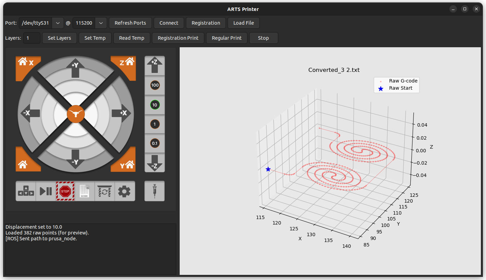

## Overview
The platform is built on a modified **Prusa i3 MK3S+**, where the standard filament extruder was removed and replaced with a syringe-based toolhead connected to a **Nordson Ultimus V high-precision air dispenser**. This configuration allows controlled deposition of gallium-based liquid metal for fabricating conductive strain sensors.

---

## System Architecture
Printer motion, pneumatic control, and user interaction are handled as separate components using **ROS2**. By decoupling motion execution from extrusion control, the system maintains a high-speed G-code stream while allowing real-time adjustment of extrusion parameters. This architecture keeps deposition stable even when printing inside custom molds or on non-standard substrates.

Each major function operates as a separate ROS2 node:

- **Printer Node:** Serves as the hardware interface for the Prusa MK3S+. It handles G-code streaming, motion execution, and spatial transformations required for printing within custom molds. During path execution, it publishes start/stop triggers to the dispenser topic to synchronize extrusion with physical motion.
- **Dispenser Node:** Translates ROS messages into the serial command protocol used by the Nordson Ultimus V. It runs a dedicated worker loop to ensure pneumatic pulses are issued with minimal jitter.
- **GUI Node:** Provides the operator interface for manual jogging, coordinate registration, and real-time parameter tuning. Extrusion pressure and vacuum settings can be adjusted mid-print without interrupting the printer’s serial buffer.

Inter-node communication is handled through asynchronous ROS2 topics and services. The Printer Node acts as the primary coordinator during path execution, issuing commands to the Dispenser Node via the `/dispenser/cmd` topic. This architecture isolates time-critical deposition control from printer motion, allowing precise liquid metal extrusion while preserving the printer’s standard motion profile.

---

## Software Control & GUI
The software interface was developed using **wxPython** and serves as the central control hub for the ROS2 system. The GUI runs as its own node, which keeps the interface responsive during long print jobs and allows manual interaction without interrupting the printer’s motion buffer.

The interface is organized into four primary control areas:

- **Manual Hardware Interface:** The GUI allows operators to manually jog printer axes, home the system, and send raw G-code commands. A dedicated control is provided for the Nordson dispenser, allowing the liquid metal to be primed and the syringe tip cleared before starting a print.
- **Coordinate Registration:** To support printing inside custom molds, the GUI includes a registration tool. The operator records three reference corners on the substrate, and the system computes a transformation matrix that aligns the digital toolpath with the physical mold.
- **Real-Time Parameter Tuning:** Extrusion pressure and vacuum retract settings can be adjusted live during a print. This makes it possible to compensate for changes in material viscosity or surface tension without re-slicing the original G-code.
- **Path Visualization:** A built-in matplotlib visualization provides a 3D preview of the loaded G-code, allowing the operator to verify the print path and coordinate offsets before committing to a deposition run.

### Data Flow & Monitoring
The GUI continuously monitors system state through a serial response terminal that displays real-time feedback from the Prusa firmware. Synchronous ROS2 services are used to poll the current nozzle position (`M114`), ensuring the graphical interface remains aligned with the printer’s physical state during manual setup and calibration.

---

## Hardware Integration
A desktop Prusa-style printer was mechanically adapted to carry a precision air dispensing toolhead. Custom mounts were designed to ensure stable extrusion while maintaining access to the printer’s full workspace.

The air dispenser allows fine-grained control over extrusion pressure, which is critical for liquid metal deposition consistency.

---

## Software & Control
A **modular ROS2 architecture** was implemented to separate concerns and enable parallel execution:

- **GUI node** – real-time parameter tuning and system control
- **Printer node** – high-speed G-code streaming and motion control
- **Dispenser node** – pressure and timing control
- **Camera node** – visual feedback and monitoring

This separation enabled sustained high-speed operation without dropped commands or timing jitter.

---

## Custom Firmware Modifications
The printer firmware was modified to:
- Integrate external heating elements
- Recalibrate motion and temperature sensors
- Adjust motion logic to account for liquid metal deposition dynamics

These changes significantly improved print repeatability and trace continuity compared to stock firmware behavior.

---

## Mold-Based Fabrication & Registration
To support fabrication inside custom molds, a **G-code transformation module** was implemented. Using user-defined registration points, print paths are transformed from global printer coordinates into mold-aligned coordinates.

This enabled:
- Accurate placement within irregular geometries
- Repeatable mold-based sensor fabrication
- Rapid iteration without redesigning toolpaths

---

## Fabrication Results
The system was used to fabricate spiral-pattern liquid metal strain sensors with consistent trace width and geometry across multiple runs.

---

## My Contributions
- Designed and built an integrated 3D printing + air dispensing platform
- Developed a custom GUI for precise, real-time control of fabrication parameters
- Implemented a modular ROS2 architecture for coordinated multi-device control
- Modified printer firmware for heating integration and liquid metal–specific motion logic
- Developed a G-code transformation pipeline for mold-aligned printing using registration points

---

## Skills & Technologies
- ROS2
- G-code generation and streaming
- Embedded firmware modification
- Precision fluid dispensing
- Mechatronic system integration
- Experimental fabrication workflows
